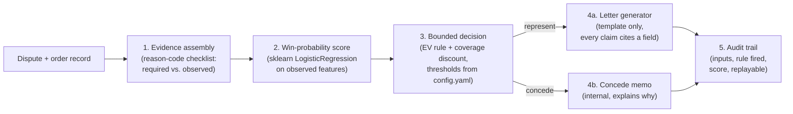

# Architecture

## Pipeline

## Component responsibilities

- **`app/reason_codes.py`** -- Defines the six supported dispute reason
  codes (10.4, 13.1, 13.3, 13.6, 13.2, UPI_UNAUTHORIZED) and each one's
  ordered evidence checklist. `coverage()` turns an observed-evidence
  dict into the fraction of that reason code's own checklist satisfied;
  `all_evidence_fields()` gives the fixed column order used everywhere
  else in the system.

- **`data/generate_data.py`** -- Synthetic dispute generator. Produces
  400 records split 300/100 train/test with a leakage-safe design:
  the outcome label (`would_win_if_represented`) is sampled from a
  hidden, latent generation process (true evidence facts + issuer
  strictness + case difficulty) that the model never sees; the model
  only ever sees noisy *observed* evidence. See the file's docstring
  for the full argument.

- **`app/scoring.py`** -- Builds a fixed-order feature vector (one-hot
  reason code + all evidence fields + amount/tenure/prior-chargeback
  count) and trains a real `sklearn.linear_model.LogisticRegression` on
  the training split. `get_model()` is a lazy, in-memory singleton --
  no pickle files, training 300 rows is instant.

- **`app/decision.py`** -- The bounded, config-driven represent-vs-concede
  rule. Computes expected value from the model's win probability,
  discounts that probability by a soft evidence-coverage factor
  (`coverage_factor = min(1, coverage / floor)`), and gates on a
  minimum-amount floor. Every threshold lives in `config.yaml`. Returns
  a human-readable `rule_applied` string with the actual numbers
  plugged in, so the decision is never a black box in the demo UI.

- **`eval/evaluate.py`** -- The actual deliverable for this track. Runs
  the full pipeline over the held-out test set, reports a confusion
  matrix / precision / recall / F1 / AUC for the production decision
  rule, sweeps a simple probability threshold (ignoring EV/coverage) to
  draw a diagnostic precision-recall-vs-threshold curve, and computes a
  money table comparing `concede_everything`, `represent_everything`,
  and `this_system` total loss over the test set. Writes
  `eval/report.json` and `eval/pr_curve.png`.

- **`app/letters.py`** -- `TemplateGenerator`, a defense-only-by-construction
  letter writer: a rebuttal sentence for a given evidence field is
  appended if and only if that field is observed `True` on the record.
  When the decision is "concede", it produces a visibly different,
  clearly labeled internal memo instead of a customer-facing letter.

- **`app/audit.py`** -- Append-only JSONL audit trail
  (`audit_log.jsonl`). `record_audit()` logs every decision's inputs,
  rule fired, score, and coverage; `get_audit()` looks one up;
  `replay()` re-runs `decide()` on the stored inputs and asserts the
  result matches, proving determinism.

- **`app/main.py`** -- FastAPI app wiring all of the above together
  (`/disputes`, `/disputes/{id}/decide`, `/disputes/{id}/respond`,
  `/audit/{id}`, `/metrics`, `/pr-curve.png`) and mounting the static
  demo page.

- **`app/static/`** -- A single-page, dependency-free vanilla JS/HTML/CSS
  demo UI: pick a dispute, see the decision with its rule shown, the
  evidence checklist, the letter or concede memo, and a Metrics tab
  with the confusion matrix, money table, and P/R curve image.
